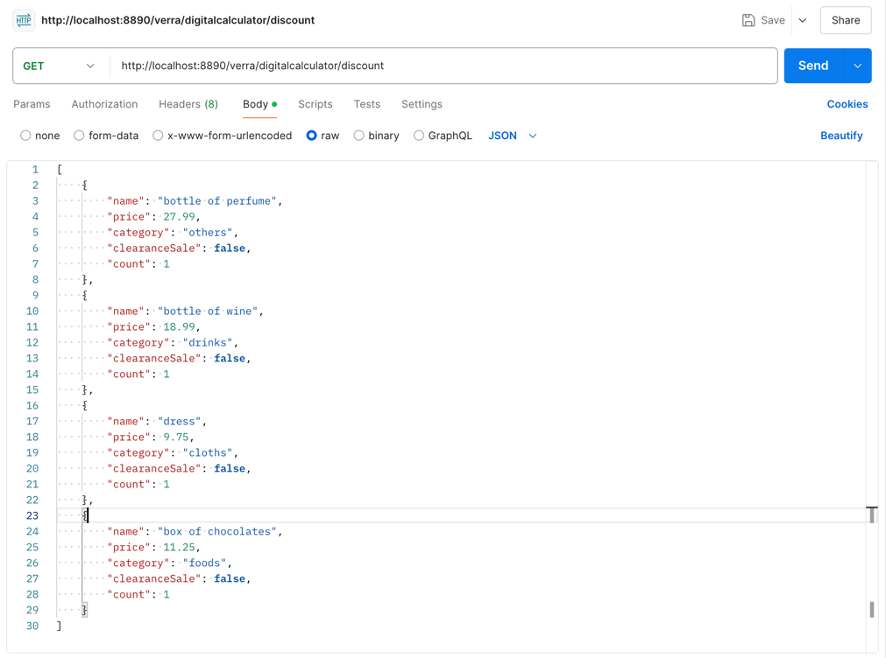
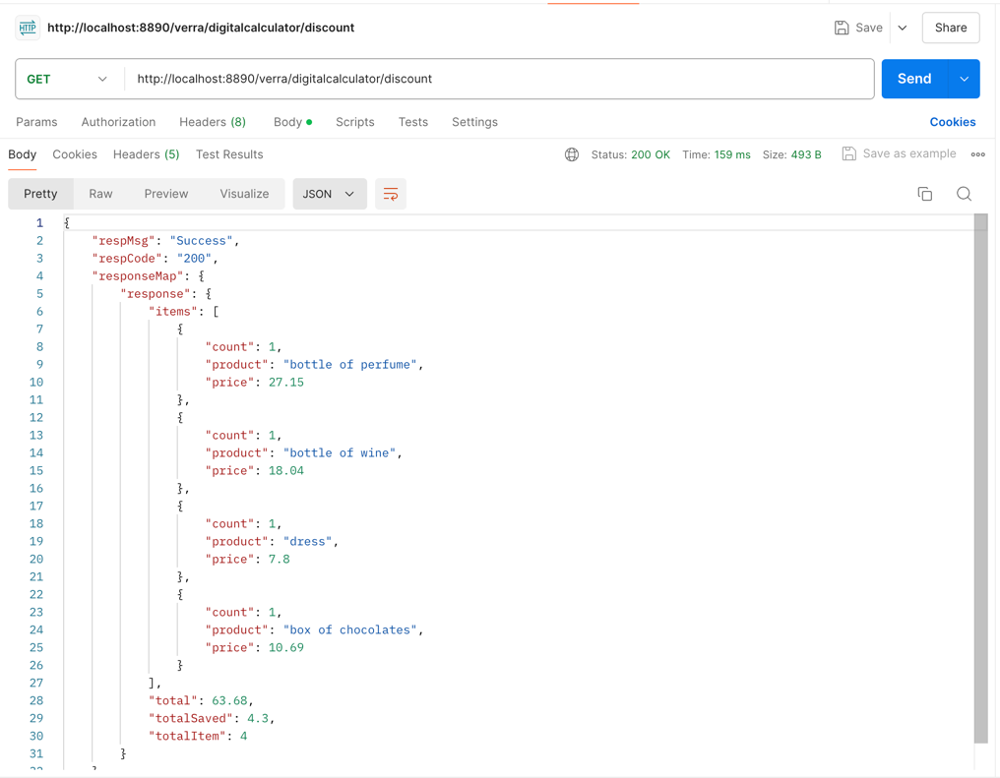
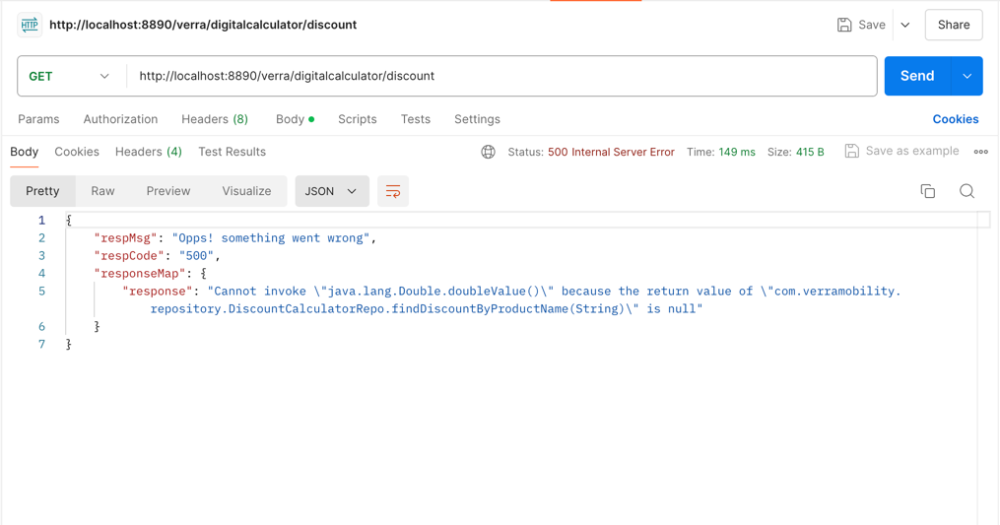

# DiscountCalculator
Verra Mobility Offline Interview

## Features
 * Calculate discounts based on item categories.
 * Support for clearance sales.
 * Generate a detailed receipt with total cost and amount saved.
 * Unit tests for verification and validation of the application logic.

## API Endpoint

### Calculate Discount

#### URL: /verra/digitalcalculator/discount

#### Method: GET

#### Headers:

#### Content-Type: application/json
#### Request Body:
The request body should be a JSON array of items, where each item has the following properties:

* name (string): The name of the item.
* price (number): The price of the item.
* category (string): The category of the item. Possible values are "foods", "drinks", "cloths", and "others".
* clearanceSale (boolean): Whether the item is on clearance sale.
* count (number): The number of items.

Example:

[
{
"name": "bottle of perfume",
"price": 27.99,
"category": "others",
"clearanceSale": false,
"count": 1
},
{
"name": "bottle of wine",
"price": 18.99,
"category": "drinks",
"clearanceSale": false,
"count": 1
},
{
"name": "dress",
"price": 9.75,
"category": "cloths",
"clearanceSale": false,
"count": 1
},
{
"name": "box of chocolates",
"price": 11.25,
"category": "foods",
"clearanceSale": false,
"count": 1
}
]

#### Response:

The response will be a JSON object containing the detailed receipt with total cost and amount saved.

#### Success Response:

#### Failure Response:

